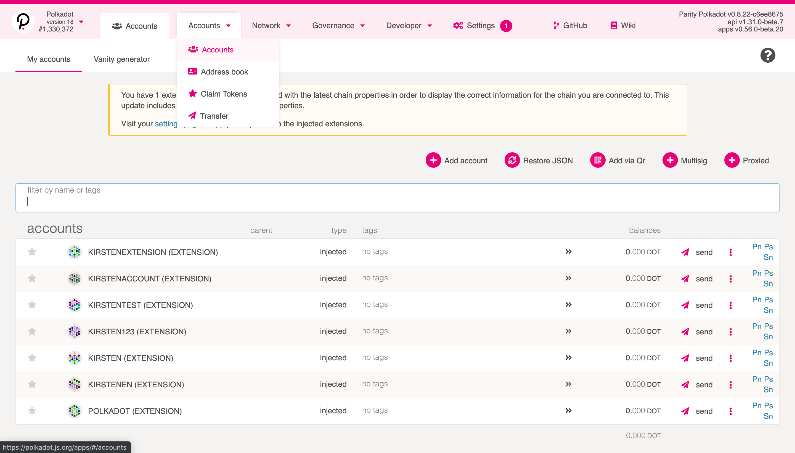
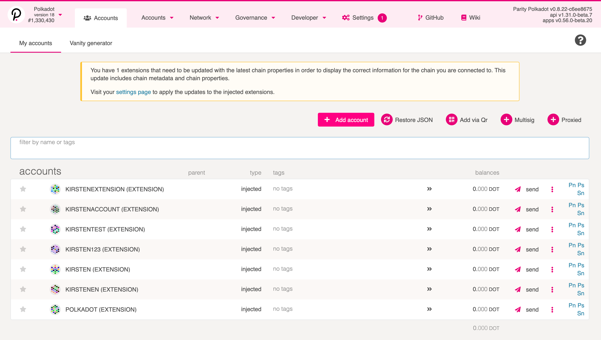
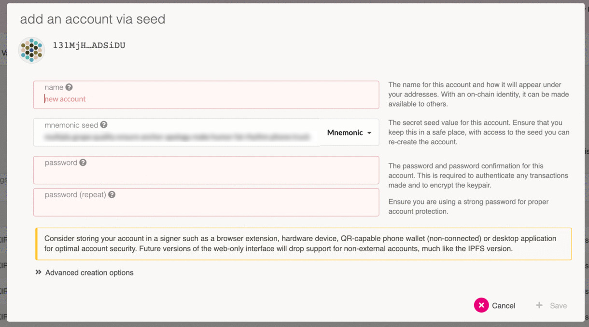
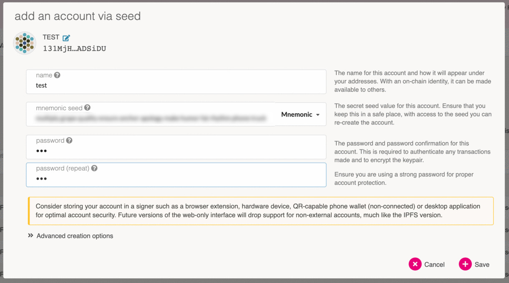

There are several ways to generate a Polkadot address:

- [Polkadot.js Browser Plugin](#polkadotjs-browser-plugin) **RECOMMENDED FOR MOST USERS**
- [Subkey](#subkey) **ADVANCED and MOST SECURE**
- [Polkadot.js Web Apps](#polkadotjs)
- [Parity Signer](#parity-signer)

> To learn more on how to create Polkadot accounts, head over to our
> [video](https://www.youtube.com/watch?v=hhUZ40ZWqkE&list=PLOyWqupZ-WGuAuS00rK-pebTMAOxW41W8&index=19)

## DISCLAIMER: Key Security

Your secret seed is the _only_ way to get access to your account. You must keep the secret both
secure and private. If you share you secret with anyone they will be able to have full access to
your account, including all of your funds. The secret, for this reason, is a target from hackers and
others with bad intentions to steal your funds. We recommend a variety of account generation methods
that have various convienience and security tradeoffs. Please review this page carefully before
making your address so that you understand the risks of the account generation method you choose and
how to properly mitigate them in order to keep your funds safe.

### Storing your key safely

The seed is your **key** to the account. Knowing the seed allows you, or anyone else who knows the
seed, to re-generate and control this account.

It is imperative to store the seed somewhere safe, secret, and secure. If you lose access to your
account, you can re-create it by entering the seed. This also means that somebody else can have
control over your account if they have access to your seed.

For maximum security, the seed should be written down on paper or another non-digital device and
stored in a safe place. You may also want to protect your seed from physical damage, as well (e.g.
by storing in a sealed plastic bag to prevent water damage, storing it in a fireproof safe, etc.) It
is recommended that you store multiple copies of the seed in geographically separate locations
(e.g., one in your home safe and one in a safety deposit box at your bank).

You should definitely not store your seed on any kind of computer that has or may have access to the
internet in the future.

## Polkadot.js Browser Plugin

The polkadot.js plugin provides a reasonable balance of security and usability. It provides a
separate local mechanism to generate your address and interact with Polkadot.

This method involves installing the polkadot.js plugin and using it as a “virtual vault," separate
from your browser, to store your private keys. It also allows signing of transactions and similar
functionality.

It is still running on the same computer you use to connected to the internet with and thus is less
secure than using Parity Signer or other air-gapped protocols.

### Install the Browser Plugin

The browser plugin is available for both
[Google Chrome](https://chrome.google.com/webstore/detail/polkadot%7Bjs%7D-extension/mopnmbcafieddcagagdcbnhejhlodfdd?hl=en)
and [FireFox](https://addons.mozilla.org/en-US/firefox/addon/polkadot-js-extension).

If you would like to know more or review the code of the plugin yourself, you can visit the Github
source [repository](https://github.com/polkadot-js/extension).

After installing the plugin, you should see the orange and white polkadot.js logo in the menu bar of
your browser.

### Open Accounts

Navigate to [Polkadot Apps](https://polkadot.js.org/apps). Click on the "Accounts" tab. This is
located in the sidebar on the left of your screen.

### Create Account

Open the polkadot.js browser extension by clicking the logo on the top bar of your browser. You will
see a separate browser window open. If you have used this extension before, you may see a list of
previously generated accounts. In any case you will see two buttons: “I want to create an account
with a new seed” and “I have a pre-existing seed, import the account."

Click “I want to create an account with a new seed”.

The polkadot.js plugin will then use system randomness to make a new seed for you and display it to
you in the form of twelve words.

You should back up these keys. It is imperative to store the seed somewhere safe, secret, and
secure. If you cannot access your account via polkadot.js for some reason, you can simply re-enter
your seed, and have access to your account once again.

Please see above for information on [storing your key safely](#disclaimer-key-security).

### Name Account

You are not able to edit the seed words. However, you should add a descriptive name for this account
in the lower textbox (e.g. “Bob”, “Jane”, or “Office Account”).

### Enter Password

After typing a name for the account, a new textbox will appear in which you can enter a password.
When you start typing, a new textbox will appear underneath it. Enter the same password in the
second textbox. If your passwords do not match, the plugin will not allow you to generate the
account.

Note that this password will protect your data in the plugin, and any backup file you export from
the plugin. It does NOT protect your seed phrase. If someone knows the twelve words in your mnemonic
seed, they still have control over your account even if they do not know the password.

### Review Account

Once both of your passwords match, the program will display information about the account that will
be generated for you.

Click on “Add the account with the generated seed”. You will be taken back to the main page of the
plugin, which should now include your generated account.

### Set Address for Polkadot Mainnet

Now we will ensure that the addresses are displayed as Polkadot mainnet addresses.

Click on "Options" at the top of the plugin window.

In the "display addresses formatted for" dropdown, select "Polkadot (live) and then click "Back".

### Get Address

Verify that your address has a “1” as the first character. This indicates that it is a Polkadot
mainnet address.

You can copy the address by double-clicking on the string representation of the address itself, and
then copying (e.g. with Control-C on Windows or Linux, Command-C on OS X). DO NOT click on the icon
representing your account (the colorful hexagon of differently-colored dots) - this will copy a
Kusama version of your address.

Be sure that you select the ENTIRE displayed address. Note that when you paste it, you will see even
more characters than are displayed.

### Copy Address

You can now copy and paste the address from the address textbox, and you now have a plain-text copy
of your Polkadot mainnet address.

Note that an address in a different format can always be converted to a Polkadot address, since the
same public key can be used for generating addresses on different networks. However, for ease of use
and understanding, it is best to ensure that you are always using Polkadot mainnet addresses.

## Subkey

Subkey is recommended for technically advanced users who are comfortable with command line and
compiling Rust code. Subkey allows you to generate keys on any device that can compile the code.
Subkey may also be useful for automated account generation, using an air-gapped device other than
one running iOS or Android or other specific purposes. It is not recommended for general users.

For detailed build and usage instructions of subkey, please see
[here](https://github.com/paritytech/substrate/tree/master/bin/utils/subkey).

## Polkadot.js

> Please note! If you use Polkadot.js to create your account and clear your cookies in your browser,
> your account will be lost forever if you do not [backup your account](learn-account-restore). If
> you create your account with Polkadot.js it is important to backup your account as it is with any
> other method you choose to generate your account with.

Using the Polkadot.js user interface without the plugin is not recommended. It is the least secure
way of generating an account. It should only be used if all of the other methods are not feasible in
your situation.

### Go to Polkadot Apps

Navigate to [Polkadot Apps](https://polkadot.js.org/apps) and click on "Accounts" underneath the
Accounts tab. It is located in the navigation bar on the top of your screen.

> Note: For these photos, I am currently connected to the Polkadot network. To create an account on
> a different network, you'll need to click on the network selection in the top left corner of the
> navigation menu. From there, you can select from a list of live, testing, and your own network to
> choose from. Do remember to hit the "Switch" button when you want to switch your network.

### Start Account Generation

Click on the "Add Account" button.

You should see a pop-up that looks like the one here. The required text fields to complete are
highlighted in pink.

You can ignore the Advanced creation options; the defaults are fine. You will have to enter an
Account Name and a password to protect your account. Be sure to select a secure and hard-to-guess
password. Note that anything will be accepted as a password here. Please note: There are no checks
to see if it is long enough or secure. You will need this password for any future interaction with
or transaction from this account.

When you have entered valid information for both, the color of the text boxes will turn from pink to
white.

Please see above for information on [storing your key safely](#disclaimer-key-security).

### Create and Back Up Account

Click “Save” and your account will be created. It will also generate a backup file that you should
save to your computer. Ideally, you would also save it on an external hard drive or thumb drive, or
print it out and be able to re-enter it later. You should not store it in cloud storage, email it to
yourself, etc.

You can use this backup file to restore your account. This backup file is not readable unless it is
decrypted with the password.

### Multi-signature Accounts

Multi-signature accounts are accounts created from several standard accounts (or even other
multi-sig accounts). For a full explanation, please see the
[Accounts Explainer section on multi-sigs](learn-accounts#multi-signature-accounts).

On the [Accounts](https://polkadot.js.org/apps/#/accounts) tab, click the `Multisig` button. Enter
the threshold and add signatories. The threshold must be less than or equal to the number of
signatories. The threshold indicates how many members must be in agreement for an extrinsic
submission to be successful. Click `Create` when done.

This merely calculates the multi-signature's address and adds it to your UI. The account does not
exist yet, and is subject to the same
[Existential Deposit and Reaping](learn-accounts#existential-deposit-and-reaping) rules as regular
accounts.

Suppose we funded it with some tokens, and now want to send from the multi-sig to another account.

The next step is to sign the transaction from with enough accounts to meet the threshold; in the
above case, two out of three signatories must sign.

There is currently no indication of a pending transaction from a multi-sig in the UI. This means the
second signatory must **repeat the call in full** in order to sign it. In other words:

- if Alice initiates a transaction from the multi-sig to Ferdie for 150 tokens, there will be a
  pending transaction in the chain.
- if Bob initiates a transaction from the multi-sig to Ferdie for 250 tokens, there will be
  **another** pending transaction in the chain, and the first one will not complete.
- because the threshold is 2/3, Charlie can now finalize either or both of these by repeating the
  desired transaction.

Other calls work exactly the same - if a multi-sig wants to become a Council member, the candidacy
request has to come from the multi-sig, but be signed (re-requested) from each signatory until the
threshold is reached.

Signatories should communicate off-chain to prevent many pending transactions and crossed
communication lines on-chain.

## Parity Signer

Parity Signer is a secure way of storing your DOT on an air-gapped device. It is highly recommended
that you turn off wifi, cellular network, Bluetooth, NFC, and any other communications methods after
installing it. If you have any communications methods turned on, you will see an "unshielded" icon
in red on the top-right corner that indicates your connection may not be secure.

### Create Account

Click "Create" to create an identity, or "recover" if you have previously backed up the recovery
phrase. You can have multiple identities on one device. Each identity can manage multiple addresses
on different networks.

### Name Account

Input the name for your identity and then click "Create".

### Back Up Account

Parity Signer will then generate a recovery phrase for you and display it in the form of 12 or 24
words.

You should write down this recovery phrase on paper and store it somewhere safe, secret, and secure.
If you cannot access your account via your phone for some reason, you can simply re-enter your
recovery phrase on another phone that has Parity Signer installed, and have access to your account
once again. This is the only way to recover your account, and anyone who has access to these words
will also have access to your account. Therefore, it is a good idea to write them down and store
them in multiple secure places!

Please see above for information on [storing your key safely](#disclaimer-key-security).

### Set PIN

After confirming that you have backed up your seed, a new textbox will appear in which you can set a
PIN. The PIN code should contain at least 6 digits. If the PIN codes do not match, it will not allow
you to create an account. The PIN code will be used for when signing any transaction, or to protect
sensitive operations such as deleting an identity or revealing the recovery phrase.

Note that if someone knows the 12/24 words in your recovery phrase, they will still have control
over your account, even if they do not know the PIN.

### Get Address

Choose which network you would like to create an address on by clicking the name of the network. For
example, if you select "Polkadot", a new Polkadot address will be created for you under this
identity.

### Your Address

The address will be shown as a QR code. You can import your address to the PolkadotJS Apps by going
to the [Accounts](https://polkadot.js.org/apps/#/accounts) page on an Internet-connected computer
and click "Add via QR", and following the instructions to add the account. An account created this
way will always require you to sign messages with your Parity Signer device. It will do this only by
scanning and displaying QR codes, leaving even someone with total control of your internet-connected
computer a very small and limited scope for interacting with the Parity Signer device, which can
continue to keep your key safe.

